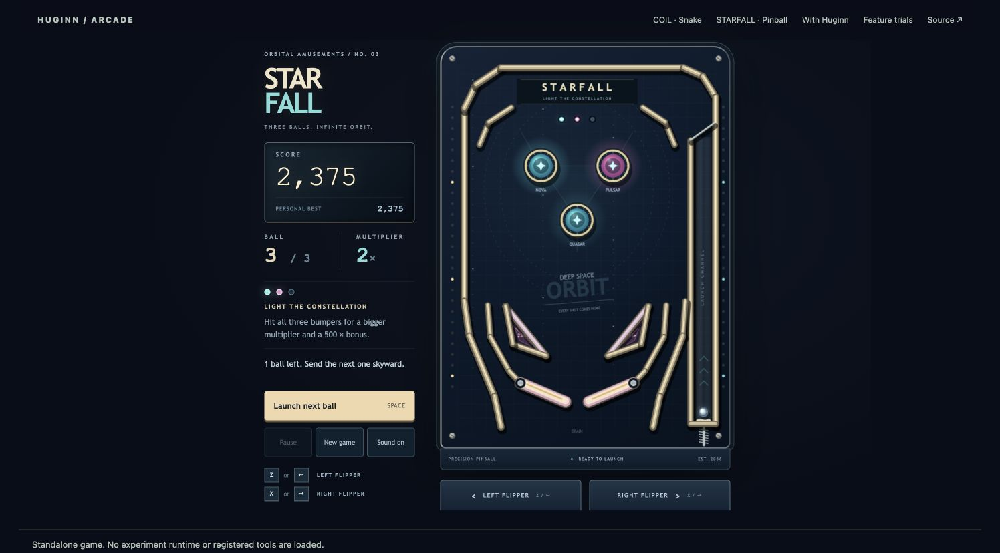

# Huginn

**Huginn gives coding agents a typed test port into the live browser games they
create, turning opaque canvas gameplay into visible, reproducible experiments.**

Canvas games are difficult for an agent to test honestly. Source code describes
intent and screenshots expose pixels, but neither reveals the current board,
legal moves, random seed, economy, or save timeline held in browser memory.
Huginn uses WebMCP to expose that live state as a small, bounded tool surface.
The human watches the real game render while the agent inspects, branches,
captures, and replays the exact gameplay moment under discussion.

## Play the submission

| Game | Genre | Renderer | Integrated | No-Huginn build |
| --- | --- | --- | --- | --- |
| COIL | Three-level campaign Snake | Native Canvas 2D | [Play](https://halmir-ai.github.io/huginn/) | [Play standalone](https://halmir-ai.github.io/huginn/games/coil/plain/) |
| STARFALL | Three-ball pinball | Native Canvas 2D | [Play](https://halmir-ai.github.io/huginn/games/starfall/) | [Play standalone](https://halmir-ai.github.io/huginn/games/starfall/plain/) |
| THORNWATCH | Tower defense | PixiJS 8 / WebGL | [Play](https://halmir-ai.github.io/huginn/games/thornwatch/) | [Play standalone](https://halmir-ai.github.io/huginn/games/thornwatch/plain/) |

These are ordinary keyboard, pointer, and touch games first. The integrated
pages add an optional debugger and eight live WebMCP tools. The standalone
pages use the same rules, controls, and renderer, while a build audit proves
their transitive bundles contain no Huginn protocol runtime.



## Test the moment, not the grind

The strongest use case is a regression hidden behind progression. COIL can
open its real Level 2 signal gate without collecting five earlier fruit.
THORNWATCH can open one of three authored defense routes without replaying a
campaign. An agent can then run two legal plans from the same seed and starting
checksum, watch every action render, and keep semantic expectations as a
portable regression.

Named setups are not arbitrary state injection. Each setup is owned by the
game, built from a seed, round-tripped through the normal save codec, and
rendered on the same canvas used for human play. Huginn adds ceremony only to
selected behavior worth preserving; unit tests, visual review, and human
judgment remain essential.

The load-bearing tool is `apply_action_sequence`. It accepts up to 50 typed
actions, checks each against the then-current legal set, renders every committed
step, records events, metrics, and checksums, supports cancellation, and stops
before an illegal action. Optional metric expectations return `passed`,
`failed`, or `inconclusive` without confusing a gameplay failure with a tool
execution failure.

## WebMCP implementation

The imperative registration boundary is intentionally concentrated in
[`src/webmcp/index.ts`](src/webmcp/index.ts). Production builds generate a
strict definition for each tool and register it directly with the page:

```ts
await document.modelContext.registerTool({
  name: "get_game_state",
  description: "Return canonical live simulation state and its checksum.",
  inputSchema: {
    type: "object",
    properties: {},
    additionalProperties: false,
  },
  execute: async () => kernel.getState(),
});
```

The complete shared surface is:

| Tool | Purpose |
| --- | --- |
| `describe_game` | Rules, goals, metric semantics, actions, setups, and limits |
| `get_game_state` | Canonical live state and checksum, never inferred from pixels |
| `get_metrics` | Compact gameplay metrics with the current checksum |
| `list_legal_actions` | Only actions valid against the current state |
| `apply_action_sequence` | Visible, bounded, seeded experiment with semantic expectations |
| `snapshot_game` | Store a canonical checkpoint in bounded page memory |
| `restore_game` | Verify and visibly restore a known checkpoint |
| `capture_game` | Show a bounded PNG preview and pair its hash to the exact state hash |

The first seven tools are portable. `capture_game` is an optional host
capability for games with a safe frame-capture path. Tool inputs use closed JSON
Schemas and accept no code, selectors, arbitrary predicates, URLs, filesystem
paths, or network targets. See the [complete tool contract](docs/TOOL_CONTRACT.md).

## Architecture

```text
game reducer + save codec + named setups
                    │
                    ▼
         protocol-independent Huginn core
                    │
       ┌────────────┴────────────┐
       ▼                         ▼
WebMCP registration       optional debugger
```

The package exposes four separate imports:

| Import | Responsibility | Browser protocol required? |
| --- | --- | --- |
| `@halmir/huginn` | Kernel, adapter types, checksums, experiments, regressions | No |
| `@halmir/huginn/webmcp` | Tool schemas, handlers, and `document.modelContext` registration | Yes |
| `@halmir/huginn/game-runtime` | Small reference runtime for reducer-first games | No |
| `@halmir/huginn/debugger` | Optional dock, receipts, captures, and replay controls | Yes |

The renderer remains on the game side of the adapter. COIL uses native Canvas
2D while THORNWATCH uses PixiJS/WebGL; both expose the same eight tools and have
successfully completed state-bound PNG capture in the in-app browser. The core
imports neither renderer. The boundary is covered statically and the recorded
smoke metadata is in
[`engine-browser-smoke.json`](tests/fixtures/arcade/engine-browser-smoke.json).
The public pages are the reproducible proof surface.

See [architecture and dependency boundaries](docs/ARCHITECTURE.md) for the full
map.

## Add Huginn to a game

Install from the public repository while the package is pre-release:

```sh
npm install github:halmir-ai/huginn#main
```

For an existing Canvas, PixiJS, Phaser, Three.js, or WebGL game, implement the
engine-neutral `GameAdapter` and connect the browser transport:

```ts
import type { GameAdapter } from "@halmir/huginn";
import { connectHuginnWebMcp } from "@halmir/huginn/webmcp";

const adapter: GameAdapter<State, Action, Event, GameMetrics> = /* game adapter */;
const huginn = await connectHuginnWebMcp(adapter, { initialSeed: 12 });
window.addEventListener("pagehide", huginn.dispose, { once: true });
```

For a new reducer-first game, define `GameDefinition` beside the first playable
reducer, route human controls through `GameRuntime.dispatch`, and mount the
debugger only in the integrated entry. The [integration guide](docs/INTEGRATION.md)
covers both paths, clock ownership, seeded randomness, save fidelity, named
setups, and verification. The [coding-agent integration contract](docs/AGENT_INTEGRATION.md)
is a ready-to-paste instrumentation brief.

## Replayable evidence

The checked-in `huginn/regression-v1` scenarios preserve meaningful behavior:

- [COIL Level 2 shield gate](public/regressions/coil-level-2-shield.json)
- [COIL shield recovery](public/regressions/coil-shield-recovery.json)
- [STARFALL saved-ball accounting](public/regressions/starfall-ball-saver.json)
- [THORNWATCH near-road defense](public/regressions/thornwatch-meadow-defense.json)

Each portable scenario contains game identity, seed, optional named setup,
typed actions, and semantic expectations. Fresh live receipts add per-step
events, metrics, and checksums. One seed is a reproducible test case—not proof
of global balance, visual quality, or fun.

## Run and verify

```sh
npm install
npm run dev
```

Use ChatGPT's in-app browser or Chrome 149+ with
`chrome://flags/#enable-webmcp-testing` for WebMCP. The games remain playable in
ordinary browsers when `document.modelContext` is unavailable.

```sh
npm run check
npm run build
npm pack --dry-run
```

The checks cover deterministic replay, save round-trips, legality, cancellation,
atomic state reads, semantic verdicts, engine boundaries, and standalone bundle
isolation. Generated build output is not committed.

The [final demo guide](docs/demo/START_HERE.md) contains the exact under-three-
minute script, tool prompts, expected outcomes, recovery steps, and claim limits.
The [submission checklist](docs/SUBMISSION_CHECKLIST.md) is the release gate.

## License and provenance

Huginn code and original procedural arcade art are licensed under
[MIT](LICENSE). The selected THORNWATCH art is separately released under CC BY
4.0 with exact source paths and hashes in
[the asset license](docs/ASSET_LICENSE.md). All implementation in this
repository is new work for the WebMCP Challenge; the provenance record is in
[docs/PROVENANCE.md](docs/PROVENANCE.md).
