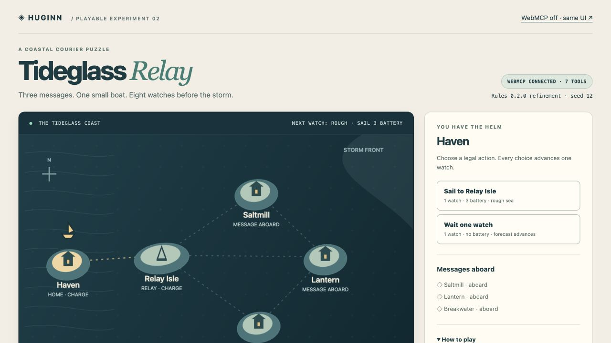

# Huginn

Huginn turns a running browser game into a controlled experiment an AI agent can
conduct while its human collaborator watches.

**Play:** [RTS Lab](https://halmir-ai.github.io/huginn/) ·
[Tideglass Relay](https://halmir-ai.github.io/huginn/tideglass/) ·
[Examples & measured comparison](https://halmir-ai.github.io/huginn/compare/)

Canvas rendering alone does not describe the current board, legal
moves, economy, RNG state, or save timeline. That state lives in JavaScript memory. Huginn
exposes that state through WebMCP as bounded, typed tools. An agent can inspect
the rules, discover legal actions, run a visible sequence, snapshot the game,
restore it, and replay the same seed to verify a result.

The load-bearing tool is `apply_action_sequence`. It validates every action
against the live state, renders every committed step, records metrics and a
checksum, supports cancellation, and stops before the first illegal action.
The imperative registration boundary is intentionally easy to inspect in
[src/huginn/webmcp.ts](src/huginn/webmcp.ts).

## Status

This repository is the new WebMCP work for [The WebMCP Challenge](https://webmcp.devpost.com/).
The two playable examples share the same kernel and seven WebMCP tools:

| Game | Genre | Experiment |
| --- | --- | --- |
| RTS Lab | Small strategy-game slice | Rush versus economy; damage, resources, base health |
| Tideglass Relay | Coastal courier logistics puzzle | Relay versus unassisted route; deliveries, battery, storm deadline |

RTS Lab's visible comparison restores one
verified snapshot, runs military-rush and economy-first branches against the
same seed, and reports the tradeoffs at the same ending cycle with per-step
metrics and checksums. Actual WebMCP calls populate the live notebook; the page
preset is clearly labeled and does not impersonate an agent invocation.

Tideglass was authored in a separate Codex task with Huginn from the start.
Its original baseline passed. A subsequently requested resource-budget
revision changed one executable rule line and was retested with the same plans:
Unassisted battery **0 → 2**, Signal **3 → 5**, both at watch 8 with three
deliveries. [Preserved baseline](docs/demo/TIDEGLASS_RELAY.md) ·
[Actual revision, source delta and receipts](docs/demo/TIDEGLASS_REFINEMENT.md).



Both games have complete ordinary controls, a readable state/rules inspector,
checkpoints, and a `?webmcp=off` mode that skips registration while retaining
the same UI and rules. The [paired replay pilot](docs/demo/COMPARISON_RESULTS.md)
matched all **46 state transitions** across modes: RTS used **25 UI commands
versus 6 WebMCP mutations**, Tideglass **27 versus 6**. Each integrated trial
also made **7 read-only calls**. Ordinary browser batching was allowed in both
modes. These are page-command measurements, **not token, latency, iteration,
or code-savings results**.

Dawn of People is a planned retrofit, **not a shipped integration**. The current
live examples prove the new-game path only. RTS Lab is a small deterministic slice,
not a full real-time RTS or evidence of a generally dominant strategy.

## Run locally

```sh
npm install
npm run dev
```

Use the **Codex in-app browser** for the rehearsed path. OpenAI's
[site-tools documentation](https://learn.chatgpt.com/docs/webmcp) confirms that
Codex and ChatGPT Work use WebMCP in the shared built-in browser. The September 2
rehearsal verified actual calls there. Chrome 149+ with
`chrome://flags/#enable-webmcp-testing` is an optional alternative; the connected
Chrome was not WebMCP-enabled. The page preset also works without WebMCP, but
is not a substitute for an agent-tool test.

See the [demo production guide](docs/demo/START_HERE.md) for word-for-word
narration, copy/paste prompts, expected results, recovery instructions, and
the optional fresh-game authoring brief. The [technical recording kit](docs/RECORDING_KIT.md)
retains the detailed test and browser receipts.

For a first Tideglass experiment, ask the agent: “Use the actual WebMCP tools.
Read the rules and legal actions, snapshot seed 12, run Signal route to watch
8, then restore and run Unassisted with a fresh request ID. Compare deliveries
and battery. Replay Unassisted and verify every step. Do not click the UI-plan
presets or claim that one seed establishes balance.”

To add a game, start with the `GameAdapter` interface in
[src/huginn/types.ts](src/huginn/types.ts) and the complete
[Tideglass adapter](src/demo/tideglass.ts). The adapter supplies deterministic
initial state, legal actions, transitions, metrics, canonical save/restore and
rendering; the shared layer supplies the seven browser tools. Game and adapter
logic are intentionally counted together, not advertised as trivial overhead.

## Verify

```sh
npm run check
npm run build
```

Huginn's code is MIT licensed. The eight selected RTS Lab PNGs are separately
released under CC BY 4.0 with exact source paths and hashes in
[docs/ASSET_LICENSE.md](docs/ASSET_LICENSE.md).

See [docs/PLAN.md](docs/PLAN.md), [docs/TOOL_CONTRACT.md](docs/TOOL_CONTRACT.md),
[docs/PROVENANCE.md](docs/PROVENANCE.md), and the
[submission checklist](docs/SUBMISSION_CHECKLIST.md).
